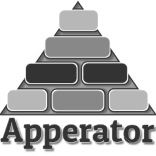

<p align="center"></p>

# `apperator` (WIP)

Main features:
- Central control of Deployment components, reusable across landscape;
- Transparent integration with [HashiCorp Vault](https://www.vaultproject.io);
- Deeper integration with Prometheus Operator;

This Operator focus on re-using components that applications have in common, to keep the ability of
defining standards applicable across an entire landscape. The primary idea is to extend functionality
of [Deployment](https://kubernetes.io/docs/reference/generated/kubernetes-api/v1.13/#deployment-v1-apps)
Resource Definition.

For handling secrets, it offers integration with
[`vault-handler`](https://github.com/otaviof/vault-handler) project. By means of setting up a
special `ConfigMap` with `vault-handler`'s manifest, the Operator generates a init-container to
download secrets before your application starts.

Additionally, this Operator watches Prometheus Alerts, when a given alert concern one of the pods
managed by Apperator, and the alert has a label indicating pod should be restarted, then Operator
will take care of restarting the pods.

## Operator Deployment

TODO: describe how to deploy the operator in a cluster;
FIXME: should you have a helm-chart to deploy the operator?

## Development

This project is developed using [Operator-SDK](https://github.com/operator-framework/operator-sdk),
if you're new to this project, please start by their
[user-guide](https://github.com/operator-framework/operator-sdk/blob/master/doc/user-guide.md).

The steps to compile this project are, please consider `Makefile` for more information:

``` sh
make bootstrap              # run dep, populate vendor directory
make                        # build operator
make test                   # unit-tests
make integration-local      # integration tests against local minikube
make integration-cluster    # integration tests against a Kubernetes cluster
```

### Global and Local Tags

Special comments (tags) are placed along the code, to export OpenAPI defintions, and generated Go
code for `DeepCopy` functions. Both are required in order to export a
[CRD (Custom Resource Definition)](https://kubernetes.io/docs/concepts/extend-kubernetes/api-extension/custom-resources/)
to be used in Kubernetes.

Using a global-tag, the definition of the package group looks as follows:

``` go
// +k8s:deepcopy-gen=package,register
// +groupName=apperator.otaviof.github.io
package v1alpha1
```

And examples of local-tags, `struct`s that should become a CRD, should have comments as the
example below:

``` go
// +k8s:openapi-gen=true
type ApperatorAppSpec struct{}
```

Generated code for `DeepCopy`:

``` go
// +k8s:deepcopy-gen:interfaces=k8s.io/apimachinery/pkg/runtime.Object
type ApperatorAppList struct{}
```

After altering the special comments, or changing the data-structures exported to Kubernetes, it's
mandatory to run:

``` sh
make generate
```

More information about this subject can be found at:
- https://github.com/kubernetes/code-generator
- https://blog.openshift.com/kubernetes-deep-dive-code-generation-customresources
